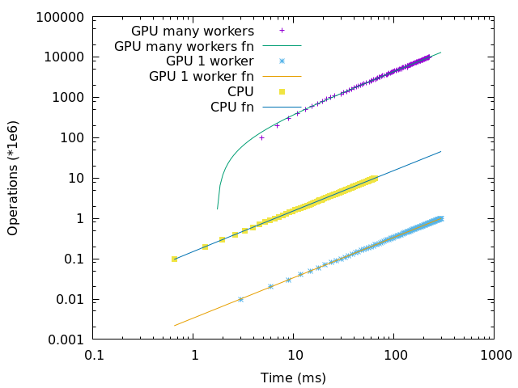

Title: AMD RX 480 GPU OpenCL benchmark
Date: 2018-12-25
Tags: AMD, Radeon, RX 480, GPU, OpenCL, Benchmark

This post summarizes the results of my [AMD GPU benchmark code][1] to
benchmark the computing power of an AMD Radeon RX 480 GPU against an
Intel Core i5-7400 CPU.

The benchmarking code I am running on is the following code:

```
__kernel void kerntest(__global char* data, int loops_cnt) {
  size_t id = get_global_id(0);
  int tmp = data[id] - 32;
  for (int i=0; i<loops_cnt; i++) {
    tmp = (2*tmp + id) % 95;
  }
  data[id] = (char)(tmp + 32);
};
```

The operation we will be counting is the one in the loop:

```
tmp = (2*tmp + id) % 95;
```

The following graph has been generated by gnuplot:



It displays on a loglog scale the number of operations performed
during a given period for:

* a single CPU
* a single GPU worker
* many GPU workers (from 10,000 to 1 Million)

Each dot corresponds to a sample, i.e the number of operations
performed during the corresponding period. Each line is the linear
approximation of the corresponding points.

A couple of statistics are printed by gnuplot:

```
-= Millions operations per second =-
CPU: 152
GPU 1 worker: 3
GPU many workers: 44045

-= Ratios =-
CPU / GPU 1 worker: 45
GPU many workers / CPU: 287
GPU many workers / GPU 1 worker: 13081
```

This means that in 1 second:

* The CPU performed 152 Millions operations.
* The GPU using 1 worker performed 3 Millions operations.
* The GPU using many workers performed 44 Billions operations.

We also computed of couple of ratios, to compare these different
results:

* The CPU performs 45 times more operations than a single GPU worker.
* The GPU with many workers performs 287 times more operations.
* the GPU with many workers performs 13081 times more operations than
  when using only 1 worker on the same GPU.

[1]: https://github.com/FlorentFlament/amd-gpu-benchmark
