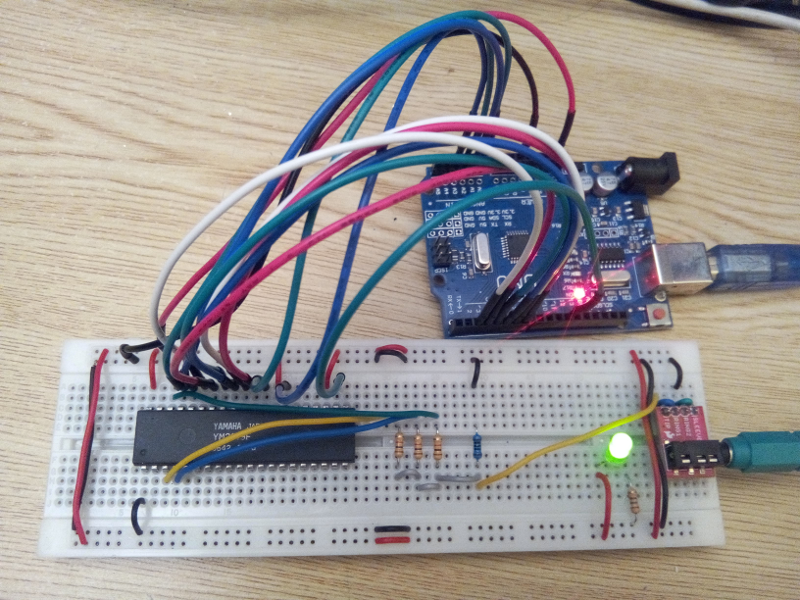

Title: Driving YM2149F sound chip with an Arduino
Date: 2016-09-03
Tags: Arduino, YM2149, YM2149F, AY-3-8910

A few months ago, I had the opportunity to get a Yamaha YM2149F
chip. This chip is basically a clone of [General Instrument's
AY-3-8910][1], "a 3 voices programmable sound generator" widely used
in the 80's in many arcade games and home computers (including the
Atari ST and Amstrad CPC).

The YM2149F chip (and its clones) can be found easily online, on
auction websites. The challenge is then to be able to drive the chip
and play some music with it. There are several blog posts out there
describing circuits to have the chip driven by a PC.

The blog post [YM2149 sound generator, Arduino and fast pin switching,
from Mr Megahertz][2] has been very inspirational for this work. It
contains a lot useful information. On the other hand, by programming
the Arduino without using the provided SDK (as described on the
[Arduino Hello World without IDE][3] blog post), we don't have any
issue to switch BDIR and BC1 signals simultaneously.

The circuit
-----------

After many experiments, I came out with a simple circuit composed of:

* A Yamaha YM2149F
* An Arduino Uno board (or clone)
* 4 resistors (3&times;1K + 1&times;100 Ohms)
* A mini jack female connector
* A breadboard
* A few wires

Here's a picture of the circuit:

The corresponding schematic follows:

Note that we don't need to use a dedicated oscillator for the
YM2149F. We can generate the required 2MHz clock with the Atmega328P
on the Arduino board.

The output stage
----------------

I made a lot of experiments on the output stage. The 4 resistors
between the 3 YM2149F outputs and the line output is a good
compromise. This forms a [passive mixer][5], which significantly
improves the quality of the sound compared to the 1 resistor stage
that can be found in most YM2149 circuits available online. The lower
the value of RL, the less distortion we have on the output, but the
lower the signal strength. I found that 100 ohms is a good
compromise. In that case, the load perceived from an output of the
YM2149F fluctuates between 1.1 and 1.6 kOhms, depending on the values
of the other channels (if my computations as correct). And according
to the [YM2149 datasheet][4] page 9, the expected load for a YM2149
output is 1kOhms. The distortion comes from the fact that the
equivalent resistance seen from a YM2149F output channel is dependent
on the other channels. The sound may be further improved by using an
active mixer, including an operational amplifier (To be tested some
day).

Testing the circuit
-------------------

The [code to drive the YM2149F from the Arduino][6] is available on
GitHub. One can compile and upload the code to the Arduino by
following the instructions of the [Arduino Hello World without IDE][3]
post. The code will have the YM2149F play continuously the C major
gamut. This code can be freely reused, especially the `ym2149`
library, which allows to drive the YM2149F chip.

Note that in order to have the ym2149-test binary work on a circuit,
one has to follow the connections described on the schematic above.

What next
---------

I will soon publish the Arduino code together with some PC side code
to have [YM files][7] streamed to the YM2149F chip.

[1]: https://en.wikipedia.org/wiki/General_Instrument_AY-3-8910
[2]: https://electronicfields.wordpress.com/2012/04/09/ym2149-sound-generator-arduino-fast-pin-switching/
[3]: http://www.florentflament.com/blog/arduino-hello-world-without-ide.html
[4]: http://www.ym2149.com/ym2149.pdf
[5]: https://en.wikipedia.org/wiki/Electronic_mixer
[6]: https://github.com/FlorentFlament/ym2149-test
[7]: http://leonard.oxg.free.fr/ymformat.html