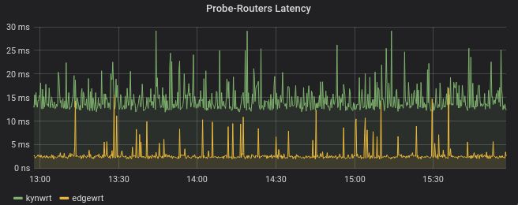

Title: Monitoring with Prometheus and Grafana
Date: 2020-10-09
Tags: monitoring, grafana, prometheus, openwrt

I've been using Prometheus and Grafana to monitor my physical and
virtual machines for several months, and I recently started monitoring
my router running OpenWrt as well.. I think these are great tools to
"see" what's happening on my infrastructure. These are my "eyes"
regarding my machines and my network.

Here's an overview of the components at play on a Prometheus / Grafana
monitoring setup (the arrows show the flow of data):

                      +--------+
                      | Alerts |
                      +---+----+
                          ^
                          |
    +---------+     +------------+     +------------+
    | Grafana |--<--| Prometheus |--<--| Prometheus |
    +---------+     +-----+------+     | Exporter   |
                          |            +------------+
                      +---+---+
                      | TSDB  |
                      | Store |
                      +-------+

# Prometheus Exporters

The Prometheus exporter (on the right) exposes metrics from a machine
or a system (for instance a Ceph cluster). It exposes an HTTP endpoint
that can be used to fetch metrics at any point in time. This component
is usually stateless, it exposes metrics that are otherwise available
through non-http APIs (like Operating System metrics that are exposed
through the `/proc` virtual filesystem on Linux).

Example:

    $ curl -s http://amn:9100/metrics | head
    # HELP go_gc_duration_seconds A summary of the GC invocation durations.
    # TYPE go_gc_duration_seconds summary
    go_gc_duration_seconds{quantile="0"} 4.1607e-05
    go_gc_duration_seconds{quantile="0.25"} 9.4745e-05
    go_gc_duration_seconds{quantile="0.5"} 0.000130829
    go_gc_duration_seconds{quantile="0.75"} 0.00019809
    go_gc_duration_seconds{quantile="1"} 0.01378869
    go_gc_duration_seconds_sum 11.704103484000001
    go_gc_duration_seconds_count 26788
    # HELP go_goroutines Number of goroutines that currently exist.

I am currently using the following exporters:

* [Prometheus Node exporter][1]: "Prometheus exporter for hardware and
  OS metrics exposed by *NIX kernels, ...". This is part of the
  Prometheus project and basically exposes a lot of Linux system
  metrics. That's deployed on all of my machines and VMs.

* [Ceph Manager's Prometheus Module][2]: "Provides a Prometheus
  exporter to pass on Ceph performance counters from the collection
  point in ceph-mgr". This is a module, part of the Ceph Manager
  Daemon, that exposes Ceph related metrics over an HTTP endpoint
  consumable by Prometheus.

* [OpenWrt's prometheus-node-exporter-lua][3]: "Provides node metrics
  as Prometheus scraping endpoint. This service is a lightweight
  rewrite in LUA of the official Prometheus node_exporter."

* [Prometheus Blackbox exporter][4]: "The blackbox exporter allows
  blackbox probing of endpoints over HTTP, HTTPS, DNS, TCP and ICMP."
  This exporter makes (HTTP in my case) requests to chosen endpoints,
  and exposes metrics like (requests duration, requests
  success/failure status, ...). This is great to monitor the
  availability of a service from the point of view of the the blackbox
  exporter probe. The mechanic there is a bit more complex that with
  the previous exporters, as shown in the next figure.

Blackbox exporter mechanic (although not limited to HTTP endpoints):

    +---------+     +------------+     +----------+     +----------+
    | Grafana |--<--| Prometheus |--<--| Blackbox |-->--| HTTP     |
    +---------+     +------------+     | Exporter |     | Endpoint |
                                       +----------+     +----------+

## Prometheus Node exporter

Prometheus exporters are usually installed directly on the nodes to be
monitored. For instance the "Prometheus Node exporter", as well as
many others, is packaged by most Linux distributions, as on Ubuntu
20.04:

    $ apt list "prometheus-*-exporter"
    Listing... Done
    prometheus-apache-exporter/focal 0.7.0+ds-1 amd64
    prometheus-bind-exporter/focal 0.3.0+ds-1 amd64
    prometheus-bird-exporter/focal 1.2.2-1 amd64
    prometheus-blackbox-exporter/focal 0.13.0+ds-2 amd64
    prometheus-hacluster-exporter/focal 0.4.0-2 amd64
    prometheus-haproxy-exporter/focal 0.9.0+git20180917+ds-1 amd64
    prometheus-ipmi-exporter/focal 1.1.0+ds-1 amd64
    prometheus-mongodb-exporter/focal 1.0.0+git20180522.e755a44-1 amd64
    prometheus-mysqld-exporter/focal 0.11.0+ds-1 amd64
    prometheus-nginx-exporter/focal 0.5.0+ds-2 amd64
    prometheus-nginx-vts-exporter/focal 0.10.3+git20180501.43b4556+ds-2 amd64
    prometheus-node-exporter/focal 0.18.1+ds-2 amd64
    prometheus-pgbouncer-exporter/focal,focal 1.7-1 all
    prometheus-postfix-exporter/focal 0.2.0-2 amd64
    prometheus-postgres-exporter/focal 0.8.0+ds-1 amd64
    prometheus-process-exporter/focal 0.4.0+ds-1 amd64
    prometheus-snmp-exporter/focal 0.16.1+ds-1build1 amd64
    prometheus-sql-exporter/focal 0.2.0.ds-6 amd64
    prometheus-squid-exporter/focal 1.8.2+ds-1 amd64
    prometheus-trafficserver-exporter/focal,focal 0.3.2-1 all
    prometheus-varnish-exporter/focal 1.5.2-1 amd64

Also, the latest release of the "Prometheus Node exporter" is also
available on its [GitHub release page][8]. As it is written in Go, no
dependencies are required to run the binary.

## Prometheus Node exporter on OpenWrt

Monitoring a router can provide a lot of insights on what's happening
on a network. [OpenWrt][9] is a Linux distribution that can run [on
some routers][10] (including my Ubiquiti EdgeRouter X). And there is a
rewrite of the official "Prometheus Node exporter" in Lua, with
several plugins, packaged for the OpenWrt distribution.

    # opkg list "prometheus-*-exporter-*"
    prometheus-node-exporter-lua - 2019.11.17-1 - Provides node metrics as Prometheus scraping endpoint.

     This service is a lightweight rewrite in LUA of the offical Prometheus node_exporter.
    prometheus-node-exporter-lua-bmx6 - 2019.11.17-1 - Prometheus node exporter (bmx6 links collector)
    prometheus-node-exporter-lua-bmx7 - 2019.11.17-1 - Prometheus node exporter (bmx7 links collector)
    prometheus-node-exporter-lua-nat_traffic - 2019.11.17-1 - Prometheus node exporter (nat_traffic collector)
    prometheus-node-exporter-lua-netstat - 2019.11.17-1 - Prometheus node exporter (netstat collector)
    prometheus-node-exporter-lua-openwrt - 2019.11.17-1 - Prometheus node exporter (openwrt collector)
    prometheus-node-exporter-lua-textfile - 2019.11.17-1 - Prometheus node exporter (textfile collector)
    prometheus-node-exporter-lua-wifi - 2019.11.17-1 - Prometheus node exporter (wifi collector)
    prometheus-node-exporter-lua-wifi_stations - 2019.11.17-1 - Prometheus node exporter (wifi_stations collector)

Once deployed, the `prometheus-node-exporter-lua` exposes router
metrics, that can be consumed by Prometheus:

    $ curl -s http://edgewrt.lan:9100/metrics | head
    # TYPE node_scrape_collector_duration_seconds gauge
    # TYPE node_scrape_collector_success gauge
    # TYPE node_nf_conntrack_entries gauge
    node_nf_conntrack_entries 288
    # TYPE node_nf_conntrack_entries_limit gauge
    node_nf_conntrack_entries_limit 16384
    node_scrape_collector_duration_seconds{collector="conntrack"} 0.00080108642578125
    node_scrape_collector_success{collector="conntrack"} 1
    # TYPE node_boot_time_seconds gauge
    node_boot_time_seconds 1601844891

## Prometheus Blackbox exporter

The Blackbox exporter is a different beast. It can run anywhere (a
process on a machine, or a container in Kubernetes) and exposes an
HTTP endpoint providing us with metrics about target endpoints. The
targets are provided as argument when querying the Blackbox
exporter. Here's an example:

    $ curl -s "http://blackbox.w.lan/probe?target=kynwrt.lan&module=http_2xx" | head
    # HELP probe_dns_lookup_time_seconds Returns the time taken for probe dns lookup in seconds
    # TYPE probe_dns_lookup_time_seconds gauge
    probe_dns_lookup_time_seconds 0.007699142
    # HELP probe_duration_seconds Returns how long the probe took to complete in seconds
    # TYPE probe_duration_seconds gauge
    probe_duration_seconds 0.020027102
    # HELP probe_failed_due_to_regex Indicates if probe failed due to regex
    # TYPE probe_failed_due_to_regex gauge
    probe_failed_due_to_regex 0
    # HELP probe_http_content_length Length of http content response


# Prometheus

## Scrape configuration

Now that we have setup our Prometheus exporters and that our metrics
are available on HTTP endpoints, we can tell Prometheus where to grab
its metrics through the `scrape_configs` block of Prometheus
configuration file:

    scrape_configs:
      - job_name: os
        static_configs:
          - targets:
              - kube-master0.lan:9100
              - kube-worker0.lan:9100
              - kube-worker1.lan:9100

At that point, Prometheus will start collecting the metrics at regular
intervals, as specified by the `scrap_interval` key in the config
file. It will store these metrics in its local TSDB (Time series
database), although Prometheus can be instructed to use an external
storage.

## Prometheus Query Language

From now on, we can connect to Prometheus web UI and perform some
queries on our time series using PromQL (Prometheus Query
Language). For instance:

    probe_http_duration_seconds{phase="processing"}

A time series is identified by a metric
(`probe_http_duration_seconds`) and possibly one or more labels
(`phase="processing"`). As stated by [Prometheus Data Model
documentation][5]:

* "The metric name specifies the general feature of a system that is
  measured (e.g. http_requests_total - the total number of HTTP
  requests received)."

* "Labels enable Prometheus's dimensional data model: any given
  combination of labels for the same metric name identifies a
  particular dimensional instantiation of that metric (for example:
  all HTTP requests that used the method POST to the /api/tracks
  handler)."

PromQL also allows using *functions* like these:

    irate(node_network_receive_bytes_total{instance="edgewrt.lan:9100"}[2m])

[irate documentation][6] says: "irate(v range-vector) calculates the
per-second instant rate of increase of the time series in the range
vector."

`node_network_receive_bytes_total` is actually a *Counter*, that
counts the total amount of bytes received through the network
interfaces. It keeps increasing until reset to zero. The `rate` and
`irate` functions allow respectively to compute per-second rate and
per-second instantaneous rate of increase for such counters. When
using such functions, one must specify a range upon which the rate is
computed (`[2m]` in that specific case).

## Metrics types

Here's a glimpse at the [four different types of metrics][7]:

* Counter: "A counter is a cumulative metric that represents a single
  monotonically increasing counter whose value can only increase or be
  reset to zero on restart."

* Gauge: "A gauge is a metric that represents a single numerical value
  that can arbitrarily go up and down."

* Histogram: "A histogram samples observations (usually things like
  request durations or response sizes) and counts them in configurable
  buckets."

* Summary: "it calculates configurable quantiles over a sliding time
  window."


# Grafana

Once queries have been crafted in the Prometheus web UI, one can
copy/paste them in Grafana graphs. We can build dashboards with
multiple graphs, each graph performing one or more PromQL queries
against Prometheus time series. With this raw material, it's up to
operators to build meaningful dashboards, so that they be able to
monitor their infrastructure.

Also, there are a number of [already made dashboards][13], that can be
imported into Grafana.

## Example: Monitoring network links

A use case I find interesting is how I monitor my PLC link (Power-line
communication) between my two floors (since I noticed that this link
had a tendency to fail). Here's the setup:

    +----------+     +---------+         +--------+
    | Blackbox |-->--| Edgewrt |====>====| Kynwrt |
    | Probe    |     | Router  |   PLC   | Router |
    +----------+     +---------+         +--------+

With the Prometheus Blackbox exporter, I can monitor the availability
of the routers at each end of my PLC link; I also monitor the latency
of the requests made against these 2 routers. That way, if `edgewrt`
is available while `kynwrt` isn't, chances are that the PLC link is
down. Of course, it doesn't provide me with the root cause of the
network split, but I know that something's going wrong, and where to
look to get more clues. Here are the requests I use:

* For monitoring the routers availability:

```
A = avg_over_time(probe_success{instance="http://kynwrt.lan/"}[2m])
B = avg_over_time(probe_success{instance="http://edgewrt.lan/"}[2m])
```

* For monitoring the latency between the probe and the routers:

```
A = sum(probe_http_duration_seconds{instance="http://kynwrt.lan/", phase=~"connect|processing|transfer"})
B = sum(probe_http_duration_seconds{instance="http://edgewrt.lan/", phase=~"connect|processing|transfer"})
```




# Alerts

A bit I haven't talked about yet is *Alerts*. Prometheus can be
configured to emit alerts according to user-defined rules. Here's what
these rules look like:

    rules:
      - alert: health error
        expr: ceph_health_status == 2
        for: 5m
        labels:
          severity: critical
          type: ceph_default
          oid: 1.3.6.1.4.1.50495.15.1.2.2.1
        annotations:
          description: >
            Ceph in HEALTH_ERROR state for more than 5 minutes.
            Please check "ceph health detail" for more information.

In order to handle these alerts properly and dispatch them, an
additional component (The [Prometheus Alert Manager][11]) is required.

Here's what [the doc says][12]: "The Alertmanager handles alerts sent
by client applications such as the Prometheus server. It takes care of
deduplicating, grouping, and routing them to the correct receiver
integration such as email, PagerDuty, or OpsGenie. It also takes care
of silencing and inhibition of alerts."


[1]: https://github.com/prometheus/node_exporter
[2]: https://docs.ceph.com/en/latest/mgr/prometheus/
[3]: https://openwrt.org/packages/pkgdata/prometheus-node-exporter-lua
[4]: https://github.com/prometheus/blackbox_exporter
[5]: https://prometheus.io/docs/concepts/data_model/
[6]: https://prometheus.io/docs/prometheus/latest/querying/functions/#irate
[7]: https://prometheus.io/docs/concepts/metric_types/
[8]: https://github.com/prometheus/node_exporter/releases
[9]: https://openwrt.org/
[10]: https://openwrt.org/toh/start
[11]: https://github.com/prometheus/alertmanager
[12]: https://www.prometheus.io/docs/alerting/latest/alertmanager/
[13]: https://grafana.com/grafana/dashboards
